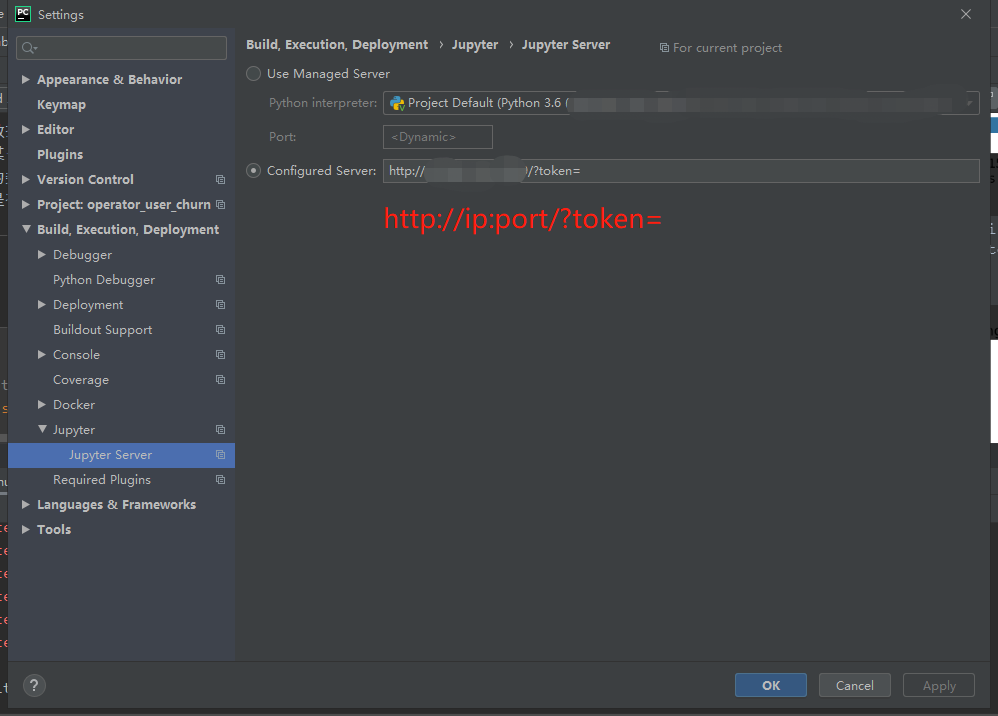

# python_notes 记录一些有关python的笔记

python 文档 https://docs.python.org/3.6/index.html


## 目录


1_selenium在add_cookie之前要先get


2_快速退出递归可以考虑return和yield


3_从list中取出元素

`pop`,`append`,`for`


4_写文件(w,wb)读文件(r,rb)

```python
# w下write()中的变量为str

# wb下write()中的变量为byte

with open("test.json", "w") as f:
        f.write(json_doc)
```

```python
# 文件里都是英文的话r,rb都行

# 文件里有中文的话用r会报错，用rb不会

with open("test.json", "r") as f:
        doc = json.load(f)
```


5_全局变量要在某个方法内对其进行修改时，要用global

```
在方法中修改全局变量时，需在方法中用 global 声明变量；
只是读全局变量的话则不需要声明。
```


6_set可以对一个list去重，可以让两个list相减，得到差集


7_ HTTP状态码


8_geohash2


9_selenium设置无界面浏览，设置user-agent，设置代理ip


10_list的指针问题


11_对dict的list去重

根据dict中的某一key的value，对dict的list去重，value相同视为重复


12_requests


13_用re去除所有html标签，保留标签里面的内容

```
75_w3lib 比 re 好用
```


13_2_用re匹配出img标签，再匹配出img标签中的图片url


13_3_用xpath去除所有html标签，保留标签里面的内容

```
xpath 效果比 re 好
```


14_re报错bad character range


15_插入到sql中的数据包含单引号（'）时，应将一个单引号（'）改成两个单引号（''）

str1 = str1.replace("'", "''")


16_进程和线程

父进程所有Python对象都必须通过pickle序列化再传到子进程去，所以，如果multiprocessing在Windows下调用失败了，要先考虑是不是pickle失败了。

16_8_多进程_多线程补充
```
多进程(multiprocessing)  https://www.cnblogs.com/smallmars/p/7093603.html
多线程(threading)  https://www.cnblogs.com/smallmars/p/7149507.html
多CPU，多核，多进程，多线程  http://www.cnblogs.com/csfeng/p/8670704.html
GIL全局锁  https://www.cnblogs.com/hukey/p/7263207.html
```

16_9_用子进程开进程池


17_从数据库中取出数据，转为list


18_验证码识别(pytesseract)


19_一款入门级的人脸、视频、文字检测以及识别的项目


20_ORM_sqlalchemy（用于操作数据库）

https://www.liaoxuefeng.com/wiki/001374738125095c955c1e6d8bb493182103fac9270762a000/0014021031294178f993c85204e4d1b81ab032070641ce5000

https://www.cnblogs.com/Zzbj/p/10212279.html

sqlalchemy实现时间列自动更新 https://blog.csdn.net/kuangshp128/article/details/85700701

sqlalchemy更新数据 https://blog.51cto.com/12965094/2362002?source=dra

20_2_ORM_sqlalchemy（外键）

20_3_ORM_sqlalchemy_外键


21_列表生成式

列出100以内3的倍数


22_获取list元素下标


23_合并dict


24_解决报错_'latin-1' codec can't encode characters in position


25_url的编码与解码

```python
urllib.parse.quote()
urllib.parse.quote_plus()

urllib.parse.unquote()
urllib.parse.unquote_plus()
```


26_执行命令行，获取命令行打印的信息

```python
# -*- coding: utf-8 -*-

import os

command = 'ping www.baidu.com '  # 可以直接在命令行中执行的命令
r = os.popen(command)  # 执行该命令
text = r.read()  # 命令行打印的信息

print(text)
```


27_日志logging

```python
# -*- coding: utf-8 -*-
# 摘自 https://docs.python.org/3.6/howto/logging.html#logging-basic-tutorial

import logging

if __name__ == '__main__':
    logging.basicConfig(filename='log_examp.log', level=logging.DEBUG)
    logging.debug('This message should go to the log file')
    logging.info('So should this')
    logging.warning('And this, too')
```


[28_python源码保护与打包](https://github.com/MrCat9/Python_Note/blob/master/python源码保护与打包)


29_django读取不在工程目录下的图片


30_django登录验证


31_django 404，500的全局配置


32_发送邮件

```
https://blog.csdn.net/qq_20417499/article/details/80566265
```


33_最大限度切分字符串（考虑顺序）

```
"123"
['123', '1', '12', '23', '2', '3']
```


[34_python操作docx](https://github.com/MrCat9/Python_Note/tree/master/python_docx_test)

`python-docx`无法处理`doc`，可以考虑将`doc`转`docx` https://blog.csdn.net/weixin_42081389/article/details/108513828
> 使用win32com时注意使用文件的绝对路径地址，否则容易报错。

35_pdf转png

36_python操作文件文件夹


37_selenium获取cookie


38_布隆过滤器(Bloom Filter)_pybloom


39_python分布式(BaseManager)


40_python获取CPU使用率，内存使用率，网络使用状态

```
https://blog.csdn.net/bubu8633/article/details/8258342
```


41_python搭建简单的web服务器实现资源文件共享

cmd 下
```
λ python -m http.server 8888
Serving HTTP on 0.0.0.0 port 8888 (http://0.0.0.0:8888/) ...
```
```
https://blog.csdn.net/u014762921/article/details/79064756/
```


42_迭代器(Iterator)生成器(generator)(yield)

```
https://blog.csdn.net/SL_World/article/details/86507872
```


43_python异步IO之协程(yield)(yield from)(async)(asyncio)

```
https://segmentfault.com/a/1190000008814676

https://blog.csdn.net/SL_World/article/details/86597738
https://blog.csdn.net/SL_World/article/details/86691747
```


43_2_网络并发库

```
greenlet
eventlet
gevent

Python协程
https://zhu327.github.io/2016/06/16/python%E5%8D%8F%E7%A8%8B/

Python eventlet 模块笔记
https://blog.csdn.net/u010827484/article/details/81223035

class eventlet.Timeout 可以向任何东西添加超时，在 timeout 秒后抛出异常

廖雪峰 gevent
https://www.liaoxuefeng.com/wiki/897692888725344/966405998508320

gevent 官网
http://www.gevent.org/index.html
```


44_selenium操作ie_python操作剪切板_python执行cmd.py

```
ie driver 下载：
http://selenium-release.storage.googleapis.com/index.html

Selenium IE webdriver 常见问题：
https://www.jianshu.com/p/3ee5587ee364
https://blog.csdn.net/u013061459/article/details/77145215

Selenium+Python调用IE浏览器：
https://www.cnblogs.com/leeboke/p/5013793.html
```


45_python操作MongoDB

```
python操作MongoDB
https://www.cnblogs.com/melonjiang/p/6536876.html
```

```
开启MongoDB

F:\mongodb\bin
λ mongod -dbpath "F:\mongoDB\data\db"
```

```
MongoDB数据导入与导出
https://www.cnblogs.com/qingtianyu2015/p/5968400.html

F:\mongodb\bin
λ mongoexport -d test_database -c test_collection -o C:\Users\admin\Desktop\test.json --type json
```


46_python去除字符串中的\x20_\xa0_\t_\n

```
75_w3lib 更好用
```

```python
# -*- coding: utf-8 -*-

str1 = '你好\x20啊\xa0啊\t啊\n啊'
print(str1)
# 你好 啊 啊	啊
# 啊

str1 = ''.join(str1.split())
print(str1)
# 你好啊啊啊啊
```


47_selenium_find_element_note

```
find_element_by_xpath
find_element_by_id
find_element_by_class_name
find_element_by_tag_name
get_attribute('href')
get_attribute('innerText')  # 取标签下的所有文本，类似于lxml的xpaht的string()  # https://www.cnblogs.com/chen/p/10931424.html
```


48_selenium_使用随机UA头


49_Python3操作Elasticsearch

```
Python3操作Elasticsearch进行增删改查  https://blog.csdn.net/weixin_42126327/article/details/81285487
```


50_newspaper3k设置useragent_proxies_headers

50_2_将外部请求下来的html源码给newspaper解析

可以给外部的请求加 useragent,proxies 等

```
news.download(input_html=html_str)
```


#### [51_re_正则匹配网页源码中的_日期时间（新闻发布时间）](https://github.com/MrCat9/Python_Note/blob/master/parser_tool.py)


52_装饰器

```
https://blog.csdn.net/qq_42156420/article/details/81169554
```


53_urllib

```
url 拼接
解析 url 的 Host
```


54_类与类变量


55_免费IP代理池

```
https://github.com/qiyeboy/IPProxyPool
```


56_tushare_股票数据

```
https://github.com/waditu/tushare
http://tushare.org/
```


57_requests乱码(encoding)


58_re（正则表达式）去除部分html标签

```
75_w3lib 更好用
```


#### [59_request_tool](https://github.com/MrCat9/Python_Note/blob/master/request_tool.py)

```
包括 selenium 和 requests 两种get url的方法
```


#### 60_itertools_排列组合


#### 61_列表list和字典dict的迭代

```
https://www.cnblogs.com/wangbin2188/p/6532510.html
```


#### 62_list排序


#### 63_map_reduce_方法

```
from functools import reduce
map()
reduce()
https://www.liaoxuefeng.com/wiki/897692888725344/989703124920288
```


#### 64_collections

https://www.liaoxuefeng.com/wiki/897692888725344/973805065315456

```
collections是Python内建的一个集合模块，提供了许多有用的集合类。

模块内有 tuple list dict 的子类，当原来的 tuple list dict 不好用的时候可以试试

namedtuple  可命名的 tuple
deque  高效实现插入和删除操作的双向列表
defaultdict  带默认值的dict，引用不存在的key时返回默认值，不会报错
OrderedDict  有序的dict
Counter 计数器
```

#### [64_2_使用Counter统计list中每种元素的个数](https://github.com/MrCat9/Python_Note/blob/master/list_element_count.py)


#### [65_验证码手动标记](https://github.com/MrCat9/Python_Note/blob/master/captcha_mark.py)


#### 66_验证码字符种类统计


#### 67_with

```
https://blog.csdn.net/lxy210781/article/details/81176687
```


#### 68_向python程序里传参数


#### 69_设置最大递归深度

```
python 最大递归次数 RuntimeError: maximum recursion depth exceeded
https://blog.csdn.net/tangwenbo124/article/details/72822692

import sys
sys.setrecursionlimit(10000)  # set the maximum depth as 10000
```


#### 70_python_whl

对于pip安装不了的包可以考虑用whl安装

https://pypi.org/simple/

https://www.lfd.uci.edu/~gohlke/pythonlibs/


#### 71_requirements

```
requirements.txt 可以同时 pip install 多个包

生成
pip freeze > requirements.txt

安装
pip install -r requirements.txt
```

> python requirements.txt使用  https://www.jianshu.com/p/9402a6818f86


#### 72_四舍五入

```
https://www.cnblogs.com/xieqiankun/p/the_truth_of_round.html
```


#### 73_hashlib_摘要算法

```
MD5  SHA1
https://www.liaoxuefeng.com/wiki/897692888725344/923057313018752
```


#### 74_twisted与deferred对象

```
https://www.cnblogs.com/xianguang/p/7027661.html
```


#### [75_w3lib](https://github.com/MrCat9/Python_Note/blob/master/w3lib_test.py)

w3lib库文档 https://w3lib.readthedocs.io/en/latest/w3lib.html

```
encoding Module
html Module
http Module
url Module
去除html标签  去除空格，换行符，制表符  去除html实体（如：&nbsp; &rdquo; &mdash; 等）  网页降噪
```


#### 76_phone库

Python(phone)模块获取手机号归属地、区号、运营商等 https://www.cnblogs.com/yaoqian/p/9358107.html


#### 77_pipenv

https://www.jianshu.com/p/d08a4aa0008e
        


#### 78_操作gif图

```
# 使用模块 imageio
imageio.mimread  # 读取gif，每一帧会存放到list的一个位置中
imageio.mimsave  # 保存gif，输入也是一个list数组
```


#### 79_PIL.Image和np.ndarray图片与Tensor之间的转换

https://blog.csdn.net/tsq292978891/article/details/78767326


#### 79_dlib

```
Windows下安装
pip install xxx.whl

Linux下安装
pip install dlib
```

dlib 官网 http://dlib.net/

dlib 文件下载 http://dlib.net/files/

人脸识别之Python DLib库进行人脸关键点识别 https://www.cnblogs.com/raorao1994/p/11001755.html

用Python实现简单的人脸相似度对比 https://blog.csdn.net/m0_38106923/article/details/83862334


#### 80_Python执行JS代码

https://blog.csdn.net/ychgyyn/article/details/90112448


#### 81_Python转js

https://blog.csdn.net/baozhourui/article/details/88058450


#### 82_selenium打开本地的html文件

```python
browser = webdriver.Chrome()
browser.get('file:///'+os.path.abspath('test.html'))  # os.path.abspath()方法可以获取文件的绝对路径
```


#### 83_让IE浏览器运行js时，不再提示“允许阻止内容”
https://blog.csdn.net/u010682330/article/details/77531028


#### 84_python字符串前的加符号的含义

python中 r'', b'', u'', f'' 的含义 https://blog.csdn.net/qq_35290785/article/details/90634344


#### 85_python生成二维码

https://github.com/sylnsfar/qrcode/blob/master/README-cn.md


#### 86_face_recognition

https://github.com/ageitgey/face_recognition

```
人脸检测  人脸识别

安装：
1. 先安装dlib
2. pip install face_recognition
```


#### 87_LabelImg

https://github.com/tzutalin/labelImg

```
Labelimg 是一个图形图像标注工具，用于在图像中标注物体边界框
```


#### 88_图像数据增强(Data Augmentation)

Augmentor https://github.com/mdbloice/Augmentor

Data Augmentation--数据增强解决你有限的数据集 https://blog.csdn.net/u010801994/article/details/81914716

非常好用的Python图像增强工具，适用多个框架 https://blog.csdn.net/u011984148/article/details/99439562

图像数据增强 https://www.cnblogs.com/siyuan1998/p/10686616.html

图像数据增强方法一览 https://segmentfault.com/a/1190000016526917


#### 89_bunch

pypi bunch https://pypi.org/project/bunch/

python函数——Bunch配置加载 https://blog.csdn.net/wcy23580/article/details/89708801

```
Bunch is a dictionary that supports attribute-style access, a la JavaScript.
```

```python
>>> b = Bunch()
>>> b.hello = 'world'
>>> b.hello
'world'
```


#### 90_汉字unicode编码范围

https://blog.csdn.net/gywtzh0889/article/details/71083459/


#### 91_PIL将png的RGBA四通道改为jpg的RGB三通道方法

https://blog.csdn.net/missyougoon/article/details/85331493

```python
img = Image.open('test.png')
img = img.convert('RGB')
```

```
PIL包含九种不同模式：1，L，P，RGB，RGBA，CMYK，YCbCr,I，F
使用Image.convert()，可以在这九中模式中进行切换。
模式1为二值图像，非黑即白。
模式L为灰度图像。
RGB就是通常说的三原色。
RGBA就是上例上的在三原色的基础上增加了一个alpha通道。
```


#### 92_用*和**给函数传参

```python
def foo(*args, **kwargs):
    print("args:", args)
    print("kwargs:", kwargs)
```

https://www.cnblogs.com/beiluowuzheng/p/8461518.html


#### 93_Faker

```
Faker is a Python package that generates fake data for you.
生成随机姓名、地址、电子邮箱等随机用户信息
```

https://github.com/joke2k/faker

https://pypi.org/project/Faker/

https://faker.readthedocs.io/en/master/locales/zh_CN.html


#### 94_爬虫js加密

python爬虫js加密解密系列文章合集 https://blog.csdn.net/weixin_33933118/article/details/89551449


#### 95_通用新闻正文解析

newspaper https://github.com/codelucas/newspaper

GeneralNewsExtractor https://github.com/kingname/GeneralNewsExtractor

利用文本及符号密度来提取新闻网页正文 https://pylist.com/t/1576112934


#### 96_通用论坛解析

https://spaces.ac.cn/archives/4422

https://blog.csdn.net/qq_34202873/article/details/78452449


#### 97_图片格式转换.ppm转.jpg

```python
from PIL import Image

img = Image.open('input_img.ppm')
img.save('output_img.jpg')
img.show()
```


#### [98_取出字符串str中的特定字符](https://github.com/MrCat9/Python_Note/blob/master/find_str_char.py)

```
取出字符串中的所有数字/所有数字和字母
```


#### 99_字符串str根据字典替换

```python
t = str.maketrans('lzZoODpq', '12200099')  # dict
r = 'olz345678q'.translate(t)  # str
print(r)  # 0123456789
```

```python
t = {
    ord('l'): '1',
    ord('z'): '2',
    ord('Z'): '2',
    ord('o'): '0',
    ord('O'): '0',
    ord('D'): '0',
    ord('p'): '9',
    ord('q'): '9',
}
# ord()
# Return the Unicode code point for a one-character string.
# 返回单个字符的 Unicode 值（int）
r = 'olz345678q'.translate(t)  # str
print(r)  # 0123456789
```


#### [100_使用正则表达式re完成字符串str根据字典替换](https://github.com/MrCat9/Python_Note/blob/master/str_dict_replace.py)

http://www.cocoachina.com/articles/88965


#### 101_re_sub_正则表达式sub替换

https://blog.csdn.net/qq_43088815/article/details/90214217?depth_1-utm_source=distribute.pc_relevant.none-task&utm_source=distribute.pc_relevant.none-task

http://www.mamicode.com/info-detail-2327645.html


#### 102_openpyxl读写excel

https://www.cnblogs.com/programmer-tlh/p/10461353.html


#### 103_package和模块

https://www.jianshu.com/p/178c26789011


#### 104_Python中的__all__

```
__all__是一个字符串list，用来定义模块中对于from XXX import *时要对外导出的符号，即要暴露的接口，但它只对import *起作用，对from XXX import XXX不起作用。
```

https://www.jianshu.com/p/ca469f693c31


#### 105_找出列表list中的重复元素

https://blog.csdn.net/August1226/article/details/82144759

```python
from collections import Counter  # 引入Counter
a = [29, 36, 57, 12, 79, 43, 23, 56, 28, 11, 14, 15, 16, 37, 24, 35, 17, 24, 33, 15, 39, 46, 52, 13]
b = dict(Counter(a))
print([key for key, value in b.items() if value > 1])  # 只展示重复元素
print({key: value for key, value in b.items() if value > 1})  # 展现重复元素和重复次数
```


#### 106_思知机器人

```
聊天机器  知识图谱
```

https://www.ownthink.com

https://github.com/ownthink/KnowledgeGraphData


#### 107_对字典dict按value排序

https://blog.csdn.net/laobai1015/article/details/85114570

```python
d = {
    '1': 1,
    '5': 5,
    '3': 3,
    '2': 2,
    '4': 4,
}
r = sorted(d.items(), key=lambda x: x[1], reverse=True)  # reverse=True -> 降序排列
print(r)
```


#### [108_wrk_压力测试性能测试工具](https://github.com/MrCat9/Python_Note/blob/master/wrk_README.md)

https://github.com/wg/wrk

HTTP压测工具之wrk https://www.jianshu.com/p/ac185e01cc30


#### 109_python高性能web框架

```
Tornado
Japronto
```


#### 110_locust_压力测试性能测试工具

https://github.com/locustio/locust

性能测试工具Locust的使用 https://www.cnblogs.com/ailiailan/p/9474973.html


#### 111_selenium_chromedriver

http://npm.taobao.org/mirrors/chromedriver/

http://chromedriver.storage.googleapis.com/index.html

chromedriver与chrome版本对应表及chromedriver和chrome各版本下载 https://blog.csdn.net/qq_40695895/article/details/90546948

chromedriver与chrome各版本及下载地址  https://blog.csdn.net/cz9025/article/details/70160273

#### 112_fake_user_agent

```
fake ua
```

[fake_ua.json](https://github.com/MrCat9/Python_Note/blob/master/fake_ua.json)

```python
import json


with open('fake_ua.json', 'r') as f:
    a = json.loads(f.read())
```

#### 113_splash

```
splash是一个javascript渲染服务，支持异步。考虑用来替换selenium。
将selenium集成到scrapy时会造成堵塞，降低scrapy异步框架的性能，所以考虑用支持异步的splash替换selenium。
```

scrapy-splash https://github.com/scrapy-plugins/scrapy-splash

python3之Splash https://www.cnblogs.com/zhangxinqi/p/9279014.html

python爬虫之Splash使用初体验 https://www.cnblogs.com/lei0213/p/8432031.html

Python爬虫：splash+requests简单示例 https://blog.csdn.net/mouday/article/details/82843401

#### [114_使用pandas解析html中的table](https://github.com/MrCat9/Python_Note/blob/master/pandas_read_html.py)

```python
dfs = pd.read_html(hs)
```

#### 115_测试框架pytest

https://docs.pytest.org/en/latest/

#### 116_dict找出value大于某值或key大于某值的所有项

```python
test_dict = {1:5, 2:4, 3:3, 4:2, 5:1}
{k:v for k, v in test_dict.items() if k>=3}  # {3: 3, 4: 2, 5: 1}
[v for k, v in test_dict.items() if k>=3]  # [3, 2, 1]

```

#### 117_jupyter的.ipynb转.py

```
> jupyter nbconvert --to script tt01.ipynb
```

```
访问 http://127.0.0.1:8888/notebooks/tt01.ipynb
File -> Download as
```

#### [118_CentOS7部署jupyter](https://github.com/MrCat9/Python_Note/blob/master/centos7_jupyter.md)

#### [119_jupyter使用不同内核（虚拟环境）](https://github.com/MrCat9/Python_Note/blob/master/jupyter_kernel.md)

#### 120_pycharm使用远程jupyter

pycharm设置jupyter服务器



#### 121_python魔法函数

__getitem__, __setitem__, __delitem__和__getattr__, __setattr__, __delattr__ https://www.jb51.net/article/168915.htm

属性描述符(__get__,__set__,__delete__)，@property类属性  https://blog.csdn.net/qq_34979346/article/details/83758447

#### 122_列表list逆序排列

Python 让列表逆序排列的 3 种方式

https://baijiahao.baidu.com/s?id=1596184962608889085&wfr=spider&for=pc

#### 123_弱口令字典

https://github.com/klionsec/SuperWordlist

#### 124_更新pip版本

Windows下 ~~`python -m pip install --upgrade pip`~~`easy_install -U pip`

Linux下 `pip install --upgrade pip`

#### 125_jupyter notebook后台运行

以`my_tt01.ipynb`为例，终端输出信息将保存在当前目录下的`nohup.out`文件中，notebook的输出将保存在`my_tt01.nbconvert.ipynb`

```
nohup jupyter nbconvert --execute --to notebook my_tt01.ipynb &
```

> 报错：TimeoutError: Cell execution timed out
>
> 可以考虑将 `/home/user001/.virtualenvs/my_virtualenvs/lib/python3.6/site-packages/nbconvert/preprocessors/execute.py`的第89行的`timeout`值由`30`改为`-1`

#### [126_将数值压缩到指定范围（归一化）`sklearn.preprocessing.MinMaxScaler`](https://github.com/MrCat9/Python_Note/blob/master/num2range.ipynb)

#### [127_使用`camelot`提取pdf中的表格](https://github.com/MrCat9/Python_Note/blob/master/camelot_test)

#### 128_jupyter显示html

jupyter渲染网页的3种方式 https://www.cnblogs.com/chenqionghe/p/12373387.html

#### 129_字符串模糊匹配

fuzzywuzzy https://github.com/seatgeek/fuzzywuzzy

python字符串模糊匹配Fuzzywuzzy https://blog.csdn.net/weixin_41413177/article/details/90300139

#### 130_pycharm

PyCharm 中文指南 http://pycharm.iswbm.com/zh_CN/latest/index.html

#### 131_python操作pptx

[python-pptx官方文档](https://python-pptx.readthedocs.io/en/latest/index.html)

用Python玩转PPT https://www.sohu.com/a/421290306_99979179

#### [132_ppt转pptx](https://github.com/MrCat9/Python_Note/blob/master/ppt2pptx.py)

#### 133_正则表达式re

正则表达式30分钟入门 https://deerchao.cn/tutorials/regex/regex.htm

#### 134_python解析pdf

`pymupdf/fitz` `pdfplumber` `pdfminer3k`

> pdfminer3k是pdfminer的python3版本
>
> pdfplumber是对pdfminer的再封装，可以先安装pdfminer3k，再安装pdfplumber

别再问如何用python提取PDF内容了 https://zhuanlan.zhihu.com/p/260670061

PyMuPDF–超强的解析PDF的Python包 http://blog.yixao.net/share/12997.html

pdf文本和表格处理——pdfplumber的安装与简单使用 https://blog.csdn.net/Elaine_jm/article/details/84841233

Python处理pdf文件 - pdfminer、pdfplumber https://blog.csdn.net/weixin_42277380/article/details/98752212

Python解析PDF提取文本及表格信息 https://blog.csdn.net/weixin_39181440/article/details/108404354

#### [135_去除字符串str中的空白符（空格/制表符/换行）](https://github.com/MrCat9/Python_Note/blob/master/str_util.py)

```
1. 使用 split 和 join
2. 使用正则 re.sub
```

#### 136_Python打包与解压zip

https://blog.csdn.net/qq_24495287/article/details/84799512

#### 137_解决`zipfile`解压时中文乱码问题

使用`gbk`替换`cp437`完成解码。先尝试使用`gbk`进行解码，出错的话再用`cp437`。

在`zipfile`源码中搜索`cp437`，将源码中的

```python
filename = filename.decode('cp437')
```

替换为

```python
try:
    filename = filename.decode('gbk')  # edit by MrCat9, if filename is Chinese.
except:
    filename = filename.decode('cp437')
```

将源码中的

```python
fname_str = fname.decode("cp437")
```

替换为

```python
try:
    fname_str = fname.decode('gbk')  # edit by MrCat9, if filename is Chinese.
except:
    fname_str = fname.decode("cp437")
```

#### 138_`win32com`报错

> 使用win32com时注意使用文件的绝对路径地址，否则容易报错。

报错 has no attribute 'CLSIDToClassMap' https://blog.csdn.net/weixin_45903952/article/details/105556034

```python
from win32com.client.gencache import EnsureDispatch
import sys
xl = EnsureDispatch("Word.Application")
print(sys.modules[xl.__module__].__file__)
```

#### 139_PyCharm给Headers加引号

PyCharm的搜索与替换功能可以使用正则表达式

```
查找：(.*?):(.*)
替换：'$1':'$2'
```

爬虫一键加引号 http://pycharm.iswbm.com/zh_CN/latest/c05/c05_08.html

#### 140_`rarfile`报错

报错`rarfile.RarCannotExec: Cannot find working tool` https://www.pianshen.com/article/4453985052/

> 方法一：将 unrar.exe 放到 venv\Scripts 目录下。
>
> 方法二：将 unrar.exe 放到 .py 文件目录下。
>
> 方法三：将unrar设为系统的环境变量。

#### 141_python操作压缩包

详解python操作压缩包的五种方法 https://www.jb51.net/article/164713.htm

> .gz .tar .tgz .zip .rar

#### 142_python调用cmd中文乱码

```python
os.system('chcp 65001')  # 防止中文乱码
```

在python上调用cmd中文乱码 https://blog.csdn.net/andy985897924/article/details/79187035

#### 143_Windows下cmd目录带空格

```
用""把带空格的目录路径括起来，如：
dir "C:\Program Files\"
```

关于Windows cmd下目录带空格的处理办法 https://blog.csdn.net/yandaonan/article/details/52047589

#### 144_`os.system`阻塞

```
Linux -> nohup
Windows -> start
```

执行os.system阻塞问题 https://blog.csdn.net/mr_li1/article/details/89353276

#### 145_`PIL`报错`image file is truncated`

```python
from PIL import ImageFile
ImageFile.LOAD_TRUNCATED_IMAGES = True  # 处理报错 OSError: image file is truncated
```

#### 146_python自动化

```
pyautogui  pywinauto  pywin32
通常配合使用，pywinauto用于启动应用，pywin32用于定位窗口，pyautogui用于控制键鼠。
```

PC端应用程序自动化测试——pywinauto、pywin32、pyautogui https://blog.csdn.net/m0_37602827/article/details/108308991

[pyautogui GitHub](https://github.com/asweigart/pyautogui)

pyautogui自动化控制鼠标和键盘操作 https://blog.csdn.net/weixin_43430036/article/details/84650938

pywinauto的简单使用 https://wlqsbyb.cn/1450

#### 147_`pptx`报错`pptx.exc.PackageNotFoundError: Package not found at`

```
空白pptx文件会报PackageNotFoundError错误
读取不存在的pptx文件时也会报PackageNotFoundError错误
```

python错误：docx.opc.exceptions.PackageNotFoundError: Package not found at 'new.docx'解决办法 https://blog.csdn.net/gaifuxi9518/article/details/81048108

#### 148_删除文件文件夹时报错`PermissionError: [WinError 5] 拒绝访问`

```
要删除的文件可能是只读文件，可以使用python执行cmd进行删除
```

Python 删除只读文件/文件夹报错：[WinError 5] 拒绝访问。 https://blog.csdn.net/COCO56/article/details/107061932/

#### 149_Mockoon

快速搭建模拟api服务

[GitHub地址](https://github.com/mockoon/mockoon)

https://mp.weixin.qq.com/s/daA6UCmrnQIJU7KegXQU1g

#### 150_FastAPI

快速python web框架

[GitHub地址](https://github.com/github-lab/fastapi)

[官方文档](https://fastapi.tiangolo.com/)

Python Web 框架之FastAPI https://www.jianshu.com/p/d01d3f25a2af

Python web框架FastAPI https://www.cnblogs.com/dcpeng/p/12716550.html

#### 151_将控制台输出保存至文件

```python
import sys
f = open('log_dir/test_log.log', 'a')  # log_dir文件夹需要先创建
sys.stdout = f
sys.stderr = f

print(1)
print('hello')
1/0

f.close()
```

python将控制台输出保存至文件 https://blog.csdn.net/u010158659/article/details/81671901

#### 152_Win10设置定时运行任务

Win10设置定时运行任务 https://zhuanlan.zhihu.com/p/115187442

#### 153_图像数据集标注工具`labelImg`

[GitHub地址](https://github.com/tzutalin/labelImg)

- 安装

  创建`pycharm`工程`my_LabelImg`，在`terminal`下执行

```
# 安装需要的包
(venv) D:\pycharm-professional-2019.3.3\admin\my_LabelImg>pip install PyQt5
(venv) D:\pycharm-professional-2019.3.3\admin\my_LabelImg>pip install pyqt5-tools
(venv) D:\pycharm-professional-2019.3.3\admin\my_LabelImg>pip install lxml
(venv) D:\pycharm-professional-2019.3.3\admin\my_LabelImg>pip install labelImg

# 运行 labelImg
(venv) D:\pycharm-professional-2019.3.3\admin\my_LabelImg>labelImg
```

- 使用

`Open Dir` 选择输入文件夹

`Change Save Dir` 选择输出文件夹

#### 154_半自动化OCR图像数据集标注工具`PPOCRLabel`

https://github.com/PaddlePaddle/PaddleOCR/blob/dygraph/PPOCRLabel/README_ch.md

#### 155_安装`python-Levenshtein`报错

```
error: Microsoft Visual C++ 14.0 is required. Get it with "Microsoft Visual C++ Build Tools": https://visualstudio.microsoft.com/zh-hans/visual-cpp-build-tools/
```

在 https://www.lfd.uci.edu/~gohlke/pythonlibs/ 上下载 `whl` ，通过 `whl` 安装

https://pypi.org/ 上有官方的 `whl`

python3.6 + win10 安装 python-Levenshtein 错误记录 https://blog.csdn.net/sky_limitless/article/details/90291893

#### 156_`Microsoft Visual C++ Build Tools`安装

https://visualstudio.microsoft.com/zh-hans/visual-cpp-build-tools/

> 安装PaddleOCR时报错 
>
> error: Microsoft Visual C++ 14.0 is required. Get it with "Microsoft Visual C++ Build Tools": https://visualstudio.microsoft.com/zh-hans/visual-cpp-build-tools/
>
> 在安装了 Microsoft Visual C++ 14.0 后报错并没有解决，最后是将py36换为py37后解决报错。

对于报错 `Microsoft Visual C++ 14.0 is required.`

1. 尝试使用 `whl` 安装。
2. 检查环境（python版本什么的）。
3. 使用 `Microsoft Visual C++ Build Tools` 安装。

#### 157_pip安装失败时

pip安装失败时尝试更新`pip`和`setuptools`

#### 158_报错`No module named 'google'`

`pip install protobuf`

#### 159_报错`ImportError: DLL load failed: 找不到指定的模块。`

> DLL load failed 一般是由于
>
> 1.包损坏    2.python和包版本的问题
>
> 因此先尝试 pip uninstall 再 pip install 重装包
>
> 再考虑版本匹配问题

在Windows10+python3.7.9环境下安装`PPOCRLabel`
pyclipper==1.2.1 时
执行 `python PPOCRLabel.py --lang ch` 报错如下

```
Traceback (most recent call last):
  File "PPOCRLabel.py", line 35, in <module>
    from paddleocr import PaddleOCR
  File "..\paddleocr.py", line 28, in <module>
    from tools.infer import predict_system
  File "..\tools\infer\predict_system.py", line 31, in <module>
    import tools.infer.predict_det as predict_det
  File "..\tools\infer\predict_det.py", line 31, in <module>
    from ppocr.data import create_operators, transform
  File "..\ppocr\data\__init__.py", line 34, in <module>
    from ppocr.data.imaug import transform, create_operators
  File "..\ppocr\data\imaug\__init__.py", line 20, in <module>
    from .make_border_map import MakeBorderMap
  File "..\ppocr\data\imaug\make_border_map.py", line 12, in <module>
    import pyclipper
ImportError: DLL load failed: 找不到指定的模块。
```

切换为 pyclipper==1.2.0 后正常运行。

#### 160_重试模块`retrying`

https://github.com/rholder/retrying

Python重试模块retrying https://www.cnblogs.com/mangM/p/11207202.html

#### 161_`httpx`

`httpx`支持`HTTP/2.0`

#### [162_img2pdf](https://github.com/MrCat9/Python_Note/blob/master/img2pdf.py)

图片转pdf

#### 163_报错`UnicodeEncodeError`

```
如果遇到类似"UnicodeEncodeError: 'gbk' codec can't encode character '\xa5' in position 46: illegal multibyte sequence"这样的问题，读取文件时已经用了encoding='utf8'，还是报错，而且报错的位置含有print()，那可能是因为print()函数自身有限制，不能完全打印所有的unicode字符，所以只要规定一下print的打印的默认编码就行了：
```

```python
import io
import sys
sys.stdout = io.TextIOWrapper(sys.stdout.buffer, encoding='utf8')  # 改变标准输出的默认编码
```

#### [164_`list`的复制](https://github.com/MrCat9/Python_Note/blob/master/list_copy.ipynb)

```
list复制的时候注意是否影响原list

如果用 = 直接赋值，是非拷贝方法。
这两个列表是等价的，修改其中任何一个列表都会影响到另一个列表。

浅拷贝可以使用copy()，切片，列表生成式，for循环遍历等。推荐copy()

深拷贝可以使用deepcopy()

一般使用copy()
```

```python
# -*- coding: utf-8 -*-


def add_item(item, source_list):
    source_list.append(item)


list1 = [0, 1]
add_item(2, list1)
print(list1)  # [0, 1, 2]

# 函数参数传递的是实际对象的内存地址。
# 如果参数是引用类型的数据类型（列表、字典等），
# 在函数内部修改后，就算没有把修改后的值返回回去，
# 外面的值其实也已经发生了变化。
```

[Python中List的复制（直接复制、浅拷贝、深拷贝）](https://blog.csdn.net/qq_24502469/article/details/104185122)

#### 165_分割文件路径，文件名，格式（扩展/后缀）

```python
import os

test_file_path = 'D:/repository/Python_Note/split_fp_fn_fe.py'
(file_dir, file_name) = os.path.split(test_file_path)
print(file_dir)  # D:/repository/Python_Note
print(file_name)  # split_fp_fn_fe.py
(file_name2, extension) = os.path.splitext(file_name)
print(file_name2)  # split_fp_fn_fe
print(extension)  # .py
```

#### 166_类的__init__、__enter__、__exit__、__del__在with下的表现

[深挖python上下文管理——类的__init__、__enter__、__exit__、__del__在with下的表现](https://blog.csdn.net/qq_27884799/article/details/101535569)

#### 167_使用`smtplib`发送邮件时报错

```python
import smtplib

#py37
my_sender = smtplib.SMTP_SSL(host='smtp.sina.com')  # 端口为465  # py37
my_sender.connect('smtp.sina.com', 465)  # 465有用SSL

# py36
my_sender = smtplib.SMTP_SSL()  # 端口为465  # py36
my_sender.connect('smtp.sina.com', 465)  # 465有用SSL
```

[server_hostname cannot be an empty string or start with a leading dot.](https://blog.csdn.net/siweigesiweige/article/details/86167493)

#### 168_使用`smtplib`发送邮件时报错

```python
# 方法一：设置更长的超时时间
import smtplib
my_sender = smtplib.SMTP_SSL(host='smtp.sina.com', timeout=600)  # 端口为465  # py37

# 方法二：对文件进行压缩
```

[python发送邮件超时： smtplib.SMTPDataError: (451, b'Error: queue file write error')](https://blog.csdn.net/dare_kz/article/details/111882797)

#### [169_email_sender](https://github.com/MrCat9/Python_Note/blob/master/email_sender.py)

#### [170_`Linux`下安装配置`virtualenv`和`virtualenvwrapper`](https://github.com/MrCat9/Python_Note/blob/master/install_virtualenv_virtualenvwrapper4linux.md)

#### [170_1_`Linux`下安装配置`virtualenvwrapper`报错`/usr/bin/python: No module named virtualenvwrapper`](https://github.com/MrCat9/Python_Note/blob/master/install_virtualenv_virtualenvwrapper4linux.md)


