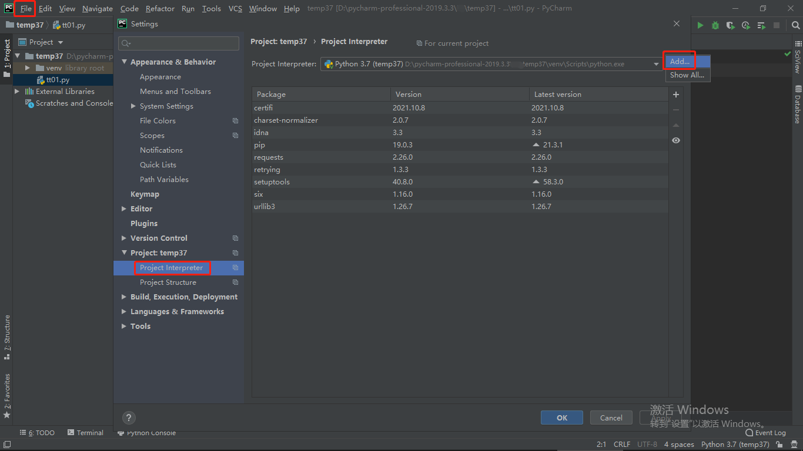
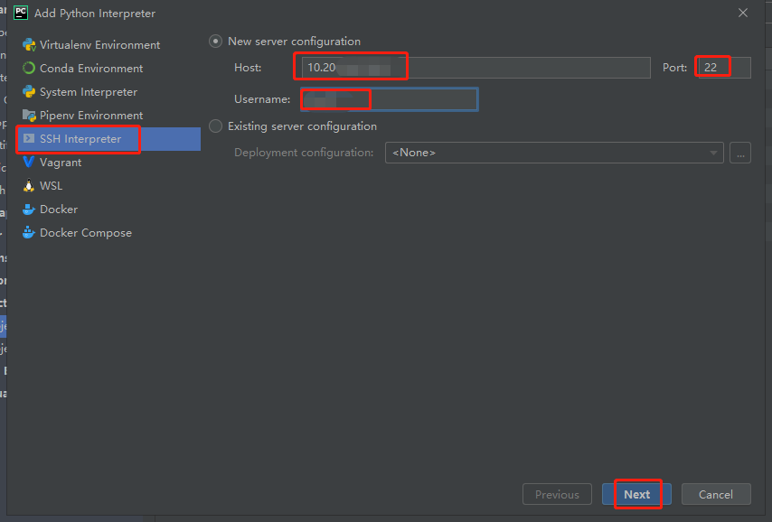
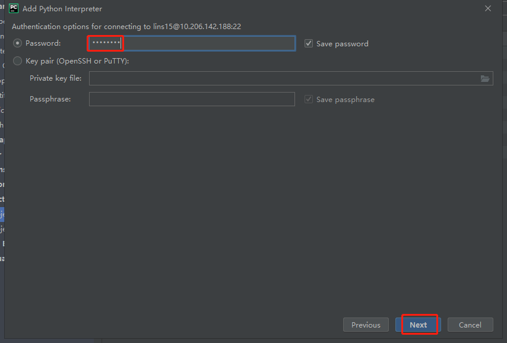
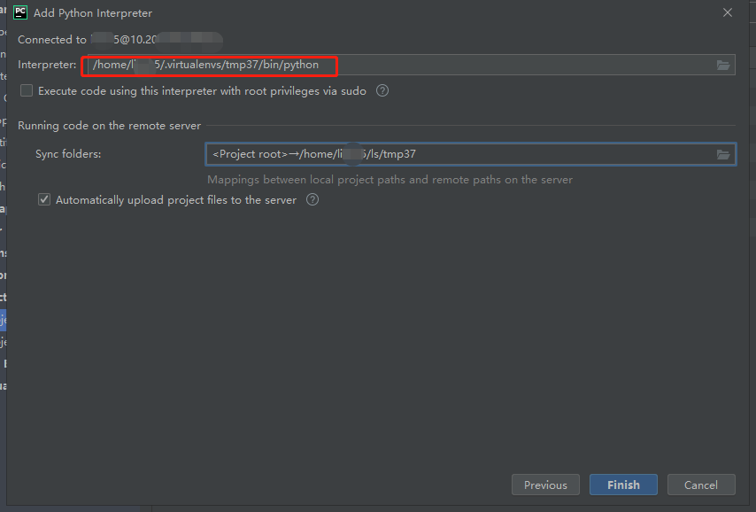
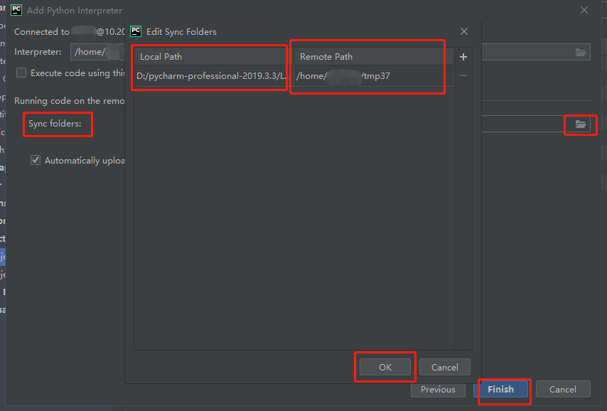
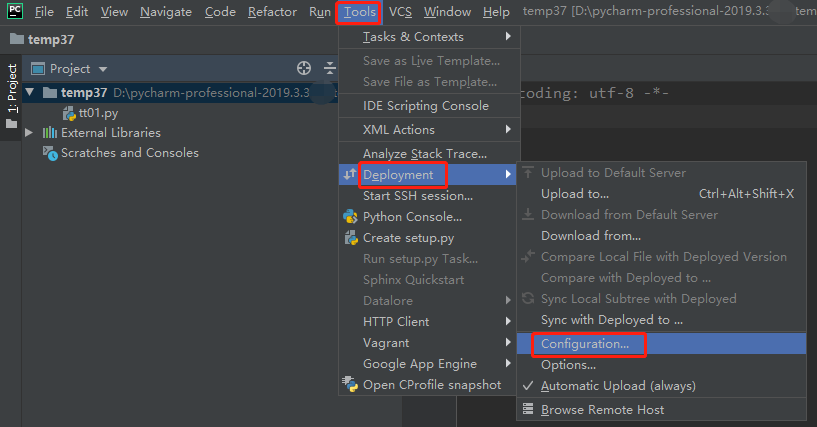
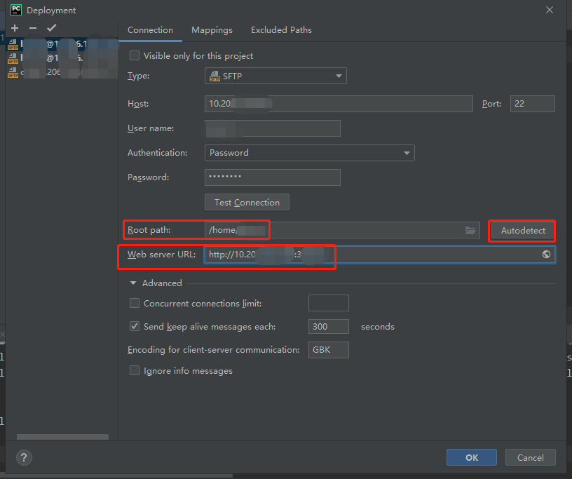
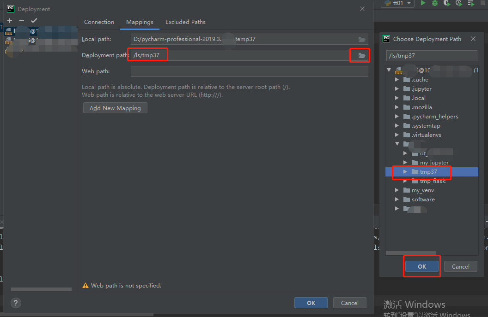
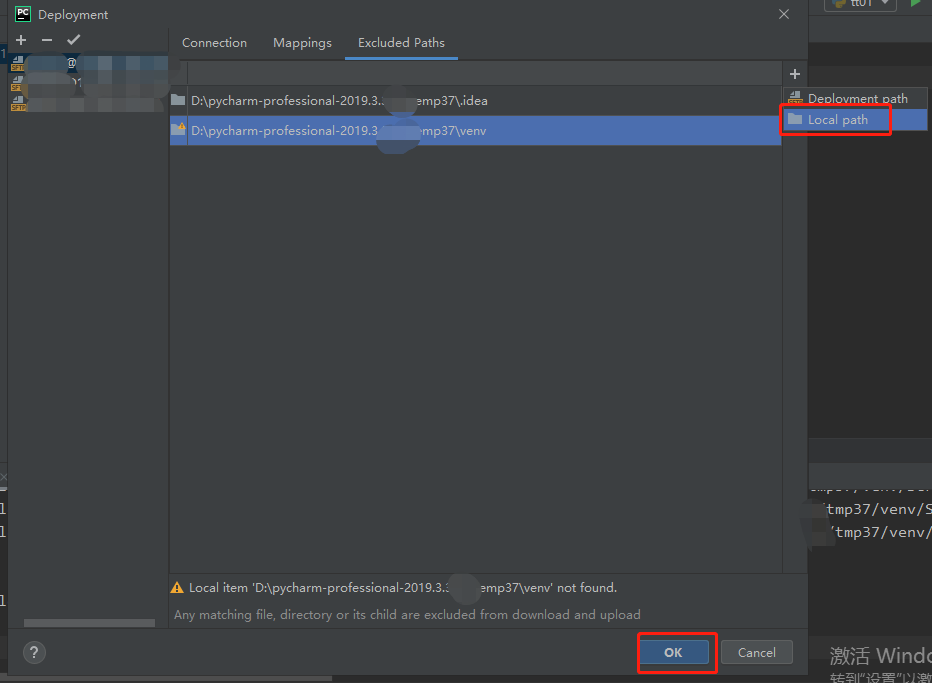
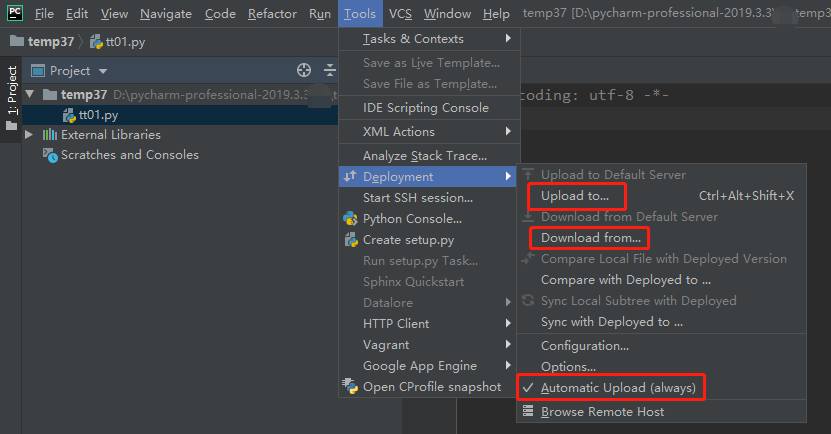

# pycharm连接远程服务器

1. 本地新建工程
2. 添加解释器
    File -> Settings -> Project -> Project Interpreter
    
3. 选择`SSH Interpreter`，输入ssh连接的`Host`，`Port`，`Username`
    
4. 输入ssh连接的`Password`
    
5. 选择远程服务器上的解释器（一般在服务器上新建一个虚拟环境，选择虚拟环境的解释器，可以用`whereis python`查找虚拟环境解释器的路径）
    
6. 选择服务器上的运行目录（一般是服务器上的项目工程目录，使用pycharm在本地工程目录编辑时，pycharm可以自动上传文件到服务器的工程目录，注意，会直接覆盖，小心选择工程目录）
    
7. 编辑远程连接
    
8. 编辑`Root path`，可以使用`Autodetect`自动填写。`Web server URL`可以填远程服务器上的jupyter服务的地址
    
9. 编辑`Deployment path`（由于修改了`Root path`，服务器上的工程目录地址也要修改）
    
10. 添加不需要上传的文件地址
    
11. 完成，可以上传下载运行
    

